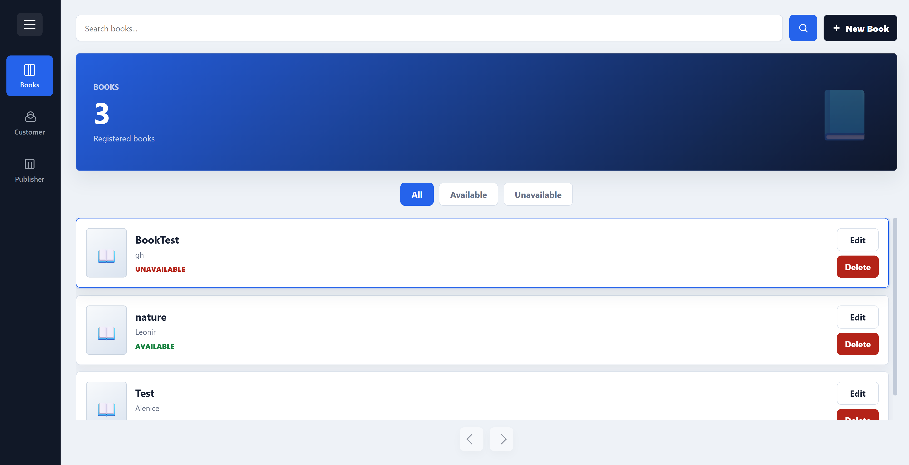
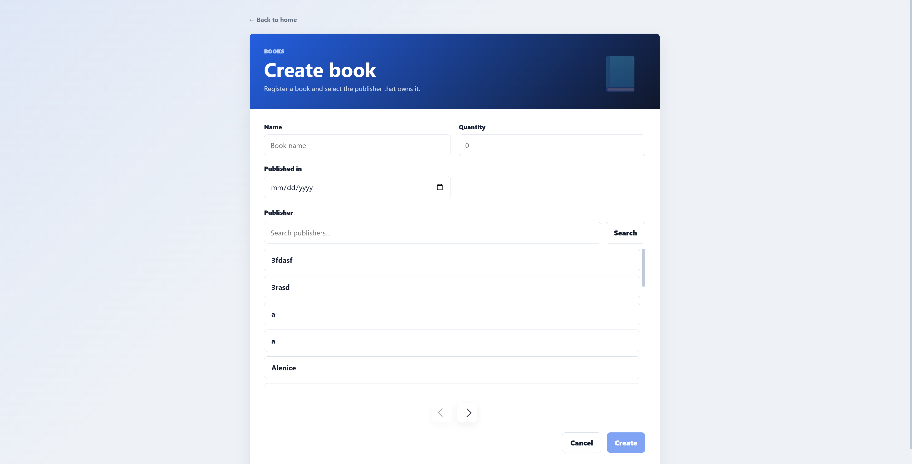
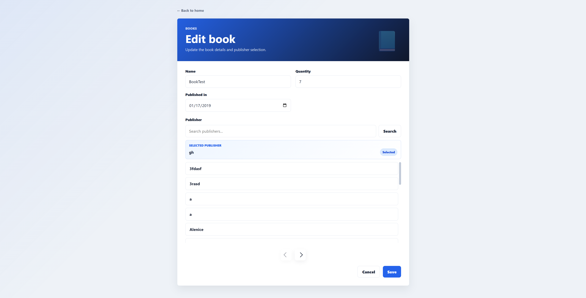
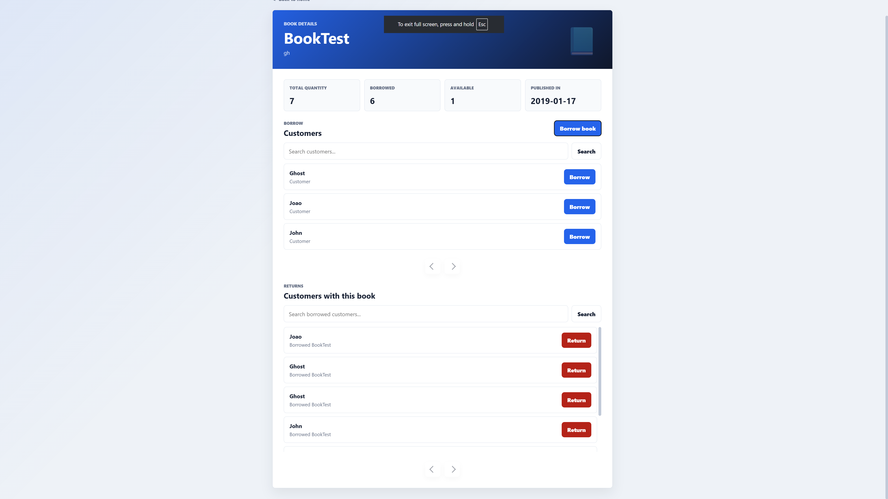
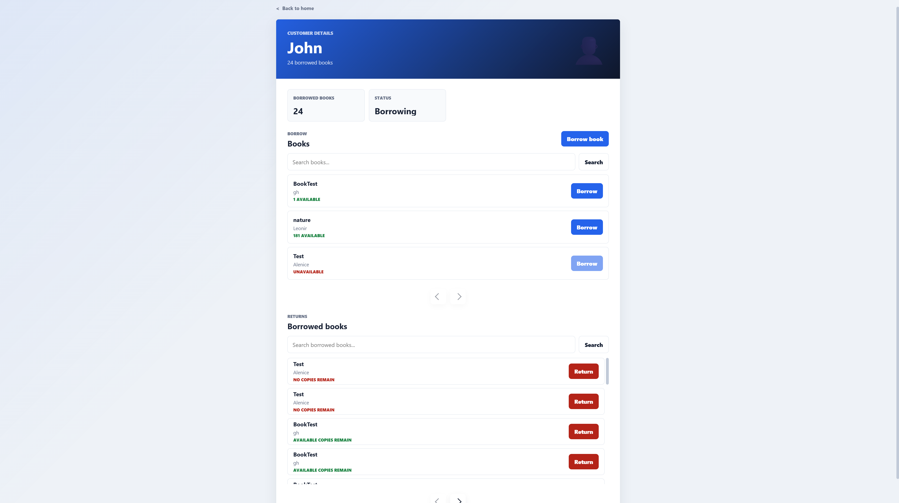

# Book Project

Fullstack book management system with a Java/Spring Boot backend and an Angular frontend. The API manages books, customers and publishers, with pagination, filters and book loan/return operations.

The Angular frontend is a simple visual interface to use the API and keep the project easy to see.

## Screenshots







## Stack

**Backend**

- Java 21
- Spring Boot 4
- Spring Web MVC
- Spring Data JPA
- Spring Validation
- PostgreSQL
- Docker Compose
- Maven
- JUnit

**Frontend**

- Angular 20
- TypeScript
- SCSS

## Features

- Book creation, listing, editing and deletion
- Customer creation, listing, editing and deletion
- Publisher creation, listing, editing and deletion
- Paginated search with filters
- Book availability control
- Borrow and return book operations
- DTOs with request validation
- Service layer tests

## Running Locally

Requirements: Java 21+, Maven, Docker, Node.js, npm and Angular CLI.

From the project root, start PostgreSQL:

```bash
cd backend
docker compose up -d
```

Run the backend:

```bash
cd backend
./mvnw spring-boot:run
```

On Windows:

```bash
cd backend
mvnw.cmd spring-boot:run
```

Run the frontend:

```bash
cd frontend
npm install
npm start
```

URLs:

```text
Backend:  http://localhost:8080
Frontend: http://localhost:4200
```

## API Overview

- `POST /api/books/{publisherId}` - create book
- `GET /api/books?filter=ALL&page=0&size=20` - list books
- `GET /api/books/{id}` - find book by id
- `PATCH /api/books/{id}` - edit book
- `DELETE /api/books/{id}` - delete book
- `POST /api/books/{bookId}/borrow/{customerId}` - borrow book
- `POST /api/books/{bookId}/return/{customerId}` - return book
- `POST /api/customers` - create customer
- `GET /api/customers?filter=ALL&page=0&size=20` - list customers
- `POST /api/publishers` - create publisher
- `GET /api/publishers?filter=ALL&page=0&size=20` - list publishers

## Testing

```bash
cd backend
./mvnw test
```

On Windows:

```bash
cd backend
mvnw.cmd test
```

## Project Structure

```text
backend/
|-- application
|   |-- book
|   |-- customer
|   `-- publisher
|-- domain
|   |-- book
|   |-- customer
|   `-- publisher
`-- infrastructure

frontend/          Angular interface
docs/screenshots/  project screenshots
```

## Author

Matheus R.M Silva  
GitHub: [MathSilvaDev](https://github.com/MathSilvaDev)
